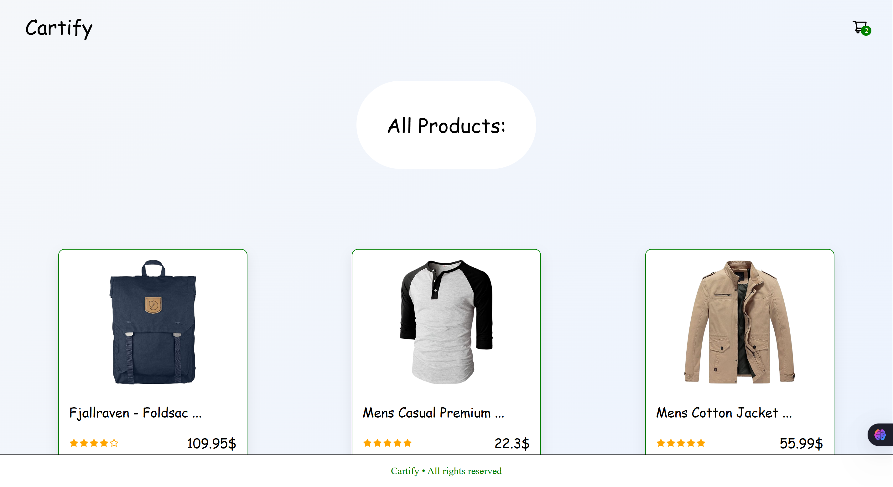
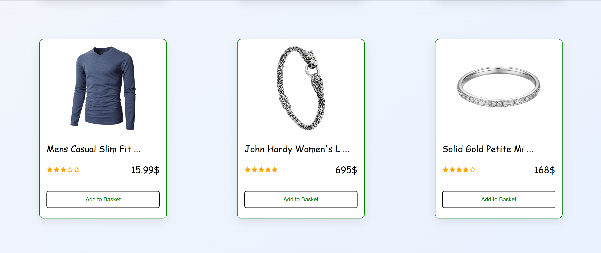
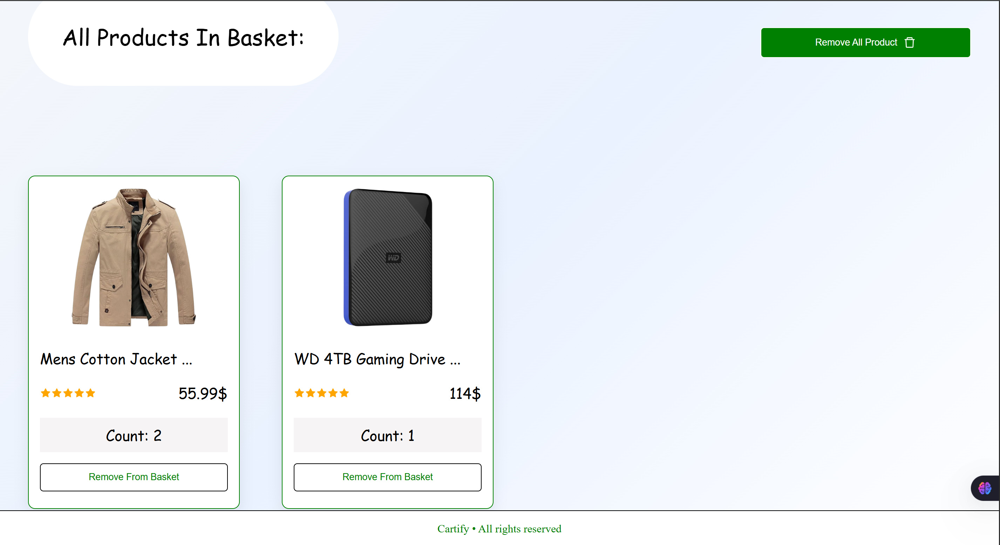

# 📦 Cartify — React + TypeScript Shopping Cart

A modern shopping cart application built with **React + TypeScript + Context API**.  
This project demonstrates state management, API integration, and a clean UI for an e-commerce experience.

---

## 🚀 Live Demo

✅ Vercel Deployment:  
👉 Live Preview: **[https://cartify-react-type-script.vercel.app]**

---

## ✨ Features

- 🛍 Product listing from Fake Store API
- ➕ Add products to cart
- ➖ Remove single product from cart
- 🧹 Remove all products
- 🔢 Product quantity management
- ⭐ Product rating system
- 🧠 Global state management with Context API
- ⚡ Fast development with Vite
- 🎯 Clean and simple UI

---

## 🛠 Tech Stack

- ⚛️ React
- 🧑‍💻 TypeScript
- 🧠 Context API
- 🌐 React Router DOM
- 🎨 CSS
- 🔌 Fake Store API
- ⚡ Vite

---

## 📸 Preview





---

## 🌐 API

This project uses Fake Store API:

```bash
https://fakestoreapi.com/products
```

---

## ⭐ Deployment (Vercel)

🚀 Deployed with Vercel for fast and continuous deployment.
Every push to the main branch triggers automatic deployment.

---

## 👨‍💻 Author

Made with ❤️ while learning React + TypeScript

- GitHub: [MuhammadRoshani](https://github.com/MuhammadRoshani)

---

## 📄 License

This project is open-source and free to use.
